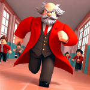
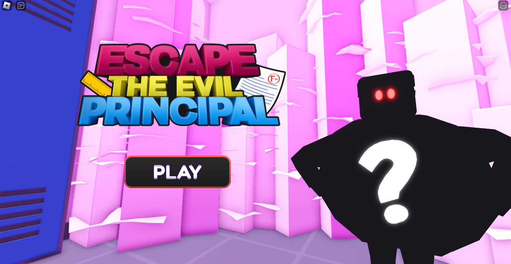
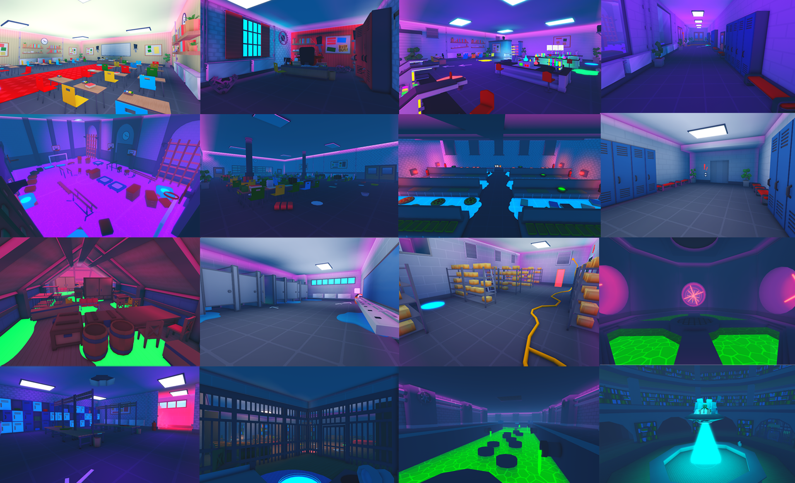
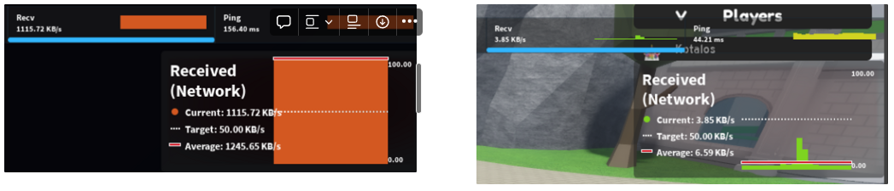
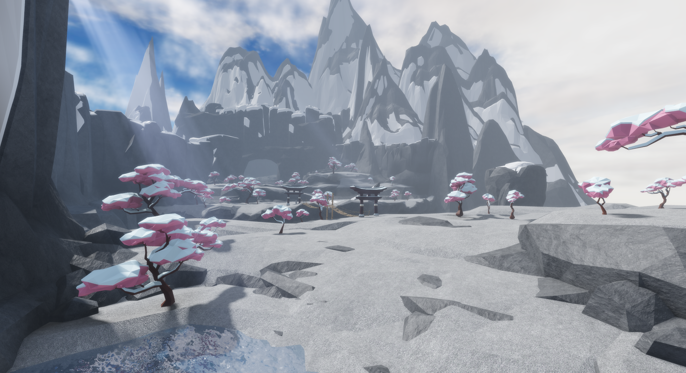
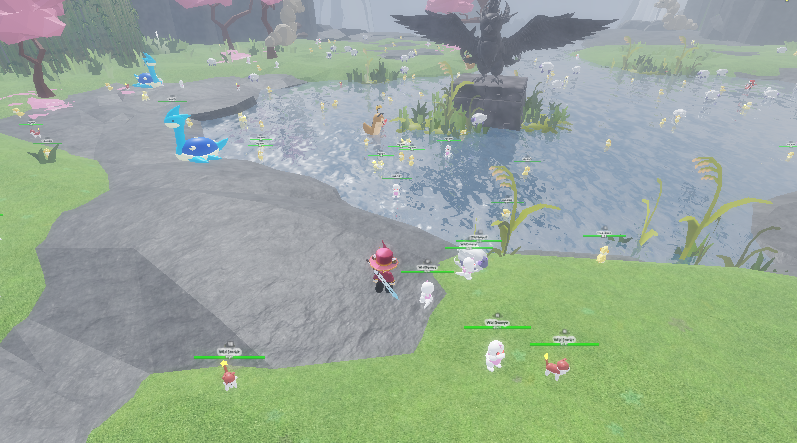

### Hi there 👋

Here are some projects I worked on.

# My Projects

## Tedium

  
  

 

A dungeon roguelike game developed in C and the SDL2 graphical library.  
In this project, I mainly took care of displaying the GUI elements properly, effectively creating a small library responsible for loading, making buttons and other UI elements responsive and functionnals, as well as unload them properly when the program ends.
 

**Github repo :** <a href="https://github.com/Lucccyo/Tedium">Lucccyo/Tedium</a>    

## Boite ITE

  
  
  
  
  

Smart Box that tracks a room's quality. Each sample cycle, the box reads sensors values for CO2 level, temperature, humidity, noise, brightness and sends the data to a webserver hosted on a raspberry PI. The data gets then displayed on a custom modular web interface.

*Device design by [drapsagt](https://github.com/drapsagt)*  

The box itself contains an ESP32, various sensors and a battery pack. The ESP32 communicates to a raspberry PI with MQTT. On the raspberry PI is hosted a web interface that displays all the data from the box in a user friendly way.

*UI design by [LouisLecouturier](https://github.com/LouisLecouturier)*

**Github repo :** <a href="https://github.com/LouisLecouturier/Boite-ITE">LouisLecouturier/Boite-ITE</a>    

## Wordle Clone

  
  

 

Recreation of the word guessing game Wordle.
With this project, I discovered and learnt the basics of frontend web development with the React framework.

  

**Github repo :** <a href="https://github.com/Kotalos/WordleClone">Kotalos/WordleClone</a>    

## Rubik's Cube’s Image Recognition

  
  

  

Rubik's cube faces configuration reader using python and OpenCV. The goal is to use this module to then solve the cube using robot arms.

  

  

## Light Fighter - School Project

A classic pong game displayed on a handcrafted led matrix where you control the player's platform with the position of your hand (in front of an infrared sensor).

   

# Work experience at [Reyouzz](https://www.linkedin.com/company/reyouzz/mycompany/) with :

  
  
  
  
  
  

  

  

# Video game development :

I have almost four years of game development and project management experience on the [Roblox](https://www.linkedin.com/company/roblox/) platform. 
 

## Some experiences I worked on :

### Evil Principal
We developped this parcour/story type game as a small team (3 devs). The goal is to venture around 20 exciting levels consisting of puzzle, traps and cinematics, to escape detention.

In this project, I was responsible for backend scripting, player data handling loading and saving, implementing the various game mechanics, coding the game loop and coding the UI interactions. 

The game is still running on the platform and has accumulated about 5M+ visits from players all around the world.

  

  
  

**Roblox game link:** [Evil Principal](https://www.roblox.com/games/11442350668/ESCAPE-EVIL-PRINCIPAL-OBBY)

### Legends Reborn
In this open-world pokémon-like game, you are free to explore the 15+ biomes, and capture more than 175+ original monsters. Talk to NPCs to complete quests, duel with your friends and other players, and take part in the seasonal events.

In this project, I was responsible for backend scripting as well. Player data handling loading and saving, implementing the various game mechanics, coding the game loop and coding the UI interactions.   
Opposite to the other games I had worked on so far, this game had an existing codebase I, and the other scripter, had to completely overhaul and improve. The extra challenge was also to keep the game running at the same time, provide consistent updates and not lose player data.  

Another task I had was to imrove gameplay performance for lower-end devices.

  

We were stuggling with lag and framerate drops for the longest time, and after some research, I was able to fix most of the obvious memory leaks and bad practices. This lead to a considerable improvement in how the game is running, allowing more players to join and enjoy the game.

We are still actively updating the game, which has now about 1.5M+ visits.

  
  

  

**Roblox game link:** [Legends Reborn](https://www.roblox.com/games/9683278586/2x-Legends-Reborn)

<!--
**Kotalos/Kotalos** is a ✨ _special_ ✨ repository because its `README.md` (this file) appears on your GitHub profile.

Here are some ideas to get you started:

- 🔭 I’m currently working on ...
- 🌱 I’m currently learning ...
- 👯 I’m looking to collaborate on ...
- 🤔 I’m looking for help with ...
- 💬 Ask me about ...
- 📫 How to reach me: ...
- 😄 Pronouns: ...
- ⚡ Fun fact: ...
-->
