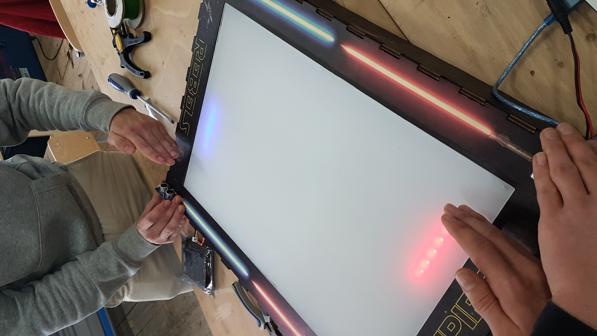

### Hi there 👋

Here are some projects I worked on.

# My Projects

## Tedium

  
  

 

A dungeon roguelike game developed in C and the SDL2 graphical library.  
In this project, I mainly took care of displaying the GUI elements properly, effectively creating a small library responsible for loading, making buttons and other UI elements responsive and functionnals, as well as unload them properly when the program ends.
 

**Github repo :** <a href="https://github.com/Lucccyo/Tedium">Lucccyo/Tedium</a>    

## Boite ITE

  
  
  
  
  

Smart Box that tracks a room's quality. Each sample cycle, the box reads sensors values for CO2 level, temperature, humidity, noise, brightness and sends the data to a webserver hosted on a raspberry PI. The data gets then displayed on a custom modular web interface.

*Device design by [drapsagt](https://github.com/drapsagt)*  

The box itself contains an ESP32, various sensors and a battery pack. The ESP32 communicates to a raspberry PI with MQTT. On the raspberry PI is hosted a web interface that displays all the data from the box in a user friendly way.

*UI design by [LouisLecouturier](https://github.com/LouisLecouturier)*

**Github repo :** <a href="https://github.com/LouisLecouturier/Boite-ITE">LouisLecouturier/Boite-ITE</a>    

## Wordle Clone

  
  

 

Recreation of the word guessing game Wordle.
With this project, I discovered and learnt the basics of frontend web development with the React framework.

  

**Github repo :** <a href="https://github.com/Kotalos/WordleClone">Kotalos/WordleClone</a>    

## Rubik's Cube’s Image Recognition

  
  

  

Rubik's cube faces configuration reader using python and OpenCV. The goal is to use this module to then solve the cube using robot arms.

  

  

## Light Fighter - School Project

A classic pong game displayed on a handcrafted led matrix where you control the player's platform with the position of your hand (in front of an infrared sensor).

   

# Work experience at [Reyouzz](https://www.linkedin.com/company/reyouzz/mycompany/) with :

  
  
  
  
  
  

  

  

# Video game development :

I have almost four years of game development and project management experience on the [Roblox](https://www.linkedin.com/company/roblox/) platform. 
 

## Some experiences I worked on :

<!--
**Kotalos/Kotalos** is a ✨ _special_ ✨ repository because its `README.md` (this file) appears on your GitHub profile.

Here are some ideas to get you started:

- 🔭 I’m currently working on ...
- 🌱 I’m currently learning ...
- 👯 I’m looking to collaborate on ...
- 🤔 I’m looking for help with ...
- 💬 Ask me about ...
- 📫 How to reach me: ...
- 😄 Pronouns: ...
- ⚡ Fun fact: ...
-->
